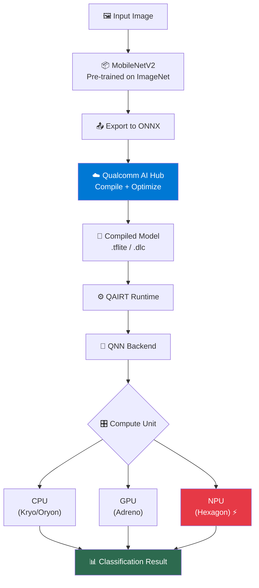

# Module 0 — What Are We Building?

| | |
|---|---|
| **Duration** | 10 minutes |
| **Goal** | Understand the workshop project, architecture, and technologies |
| **Prerequisites** | None |

---

## 🎯 Goal

By the end of this workshop, you will have built a **real-time image classifier** that runs entirely on a **Qualcomm Snapdragon NPU** — the dedicated AI accelerator inside Snapdragon chips.

You will take a pre-trained MobileNetV2 model through the **complete Qualcomm Edge AI pipeline**:

```
Pre-trained Model (PyTorch)
        ↓
Model Export (ONNX)
        ↓
Qualcomm AI Hub (Cloud Compilation)
        ↓
QAIRT / QNN Runtime
        ↓
Snapdragon NPU (Hexagon)
        ↓
On-Device Inference
        ↓
Benchmark & Optimize
```

You will also explore **GenieX** for running Large Language Models on-device.

---

## 🏗️ Architecture



---

## 🧰 Technologies You'll Learn

| Technology | What It Is | When You'll Use It |
|---|---|---|
| **Qualcomm AI Hub** | Cloud platform for compiling & profiling models on real Snapdragon hardware | Module 5 |
| **QAIRT** | Qualcomm AI Runtime — the unified runtime SDK | Module 6 |
| **QNN** | Qualcomm Neural Network API — the low-level execution engine | Module 6 |
| **Hexagon NPU** | Qualcomm's dedicated neural processing hardware | Module 6, 9 |
| **GenieX** | On-device LLM runtime for Snapdragon | Module 7 |
| **ONNX** | Open model interchange format | Module 4 |

---

## 📋 What You'll Achieve

By the end of this workshop, you will be able to:

1. ✅ Run a pre-trained ML model locally (PyTorch)
2. ✅ Export models to formats Qualcomm hardware understands (ONNX)
3. ✅ Use Qualcomm AI Hub to compile and profile models on real Snapdragon devices
4. ✅ Understand how QAIRT and QNN execute models on Snapdragon hardware
5. ✅ Benchmark and compare CPU vs GPU vs NPU performance
6. ✅ Optimize models using quantization (FP32 → INT8)
7. ✅ Run an LLM on-device using GenieX (if Snapdragon hardware available)
8. ✅ Deploy a complete AI application to Snapdragon hardware

---

## 🖥️ Hardware Paths

This workshop has TWO paths depending on your hardware:

### Path A: Without Qualcomm Hardware (Cloud Only)

You can complete **Modules 0–6, 9–10** using:
- Any development machine (Windows/Linux/Mac)
- Qualcomm AI Hub (free cloud service — compiles and profiles on real devices)

### Path B: With Snapdragon Hardware (Full Experience)

For **Modules 7–8**, you need:
- A Snapdragon-powered device (phone, laptop, or dev kit)
- Android (for mobile deployment) or Windows ARM64 (for PC deployment)

> **Don't have Snapdragon hardware?** No problem! AI Hub gives you cloud access to real Snapdragon devices. You'll still see real performance numbers.

---

## ⏱️ Workshop Timeline

| Module | Topic | Duration | Hardware Required |
|---|---|---|---|
| 0 | What Are We Building? | 10 min | None |
| 1 | Edge AI Fundamentals | 15 min | None |
| 2 | Environment Setup | 20 min | None |
| 3 | Run Model Locally | 15 min | None |
| 4 | Model Formats | 15 min | None |
| 5 | Qualcomm AI Hub | 30 min | None (uses cloud) |
| 6 | QAIRT + QNN | 20 min | None (conceptual + cloud) |
| 7 | GenieX | 20 min | Snapdragon (optional) |
| 8 | Deploy to Device | 20 min | Snapdragon (optional) |
| 9 | Benchmarking | 15 min | None (uses cloud) |
| 10 | Optimization | 20 min | None (uses cloud) |
| 11 | Final Project | 10 min | None |
| **Total** | | **~3 hours** | |

---

## 📂 Repository Structure

```
qualcomm-edge-ai-workshop/
├── README.md              ← You are here (start here)
├── docs/
│   ├── 00-overview.md     ← This file
│   ├── 01-edge-ai.md      ← Edge AI fundamentals
│   ├── 02-setup.md        ← Environment setup
│   ├── 03-first-model.md  ← Run model locally
│   ├── 04-model-formats.md ← Model export
│   ├── 05-ai-hub.md       ← Qualcomm AI Hub
│   ├── 06-qairt-qnn.md    ← QAIRT + QNN deep dive
│   ├── 07-geniex.md       ← GenieX LLM inference
│   ├── 08-deployment.md   ← Deploy to device
│   ├── 09-benchmarking.md ← Benchmarking
│   ├── 10-optimization.md ← Optimization
│   ├── 11-final-project.md ← Final project
│   └── instructor-guide.md ← For instructors
├── src/
│   ├── 01_local_inference.py  ← Module 3 code
│   ├── 02_export_model.py     ← Module 4 code
│   ├── 03_compile_model.py    ← Module 5 code
│   ├── 04_profile_model.py    ← Module 5 code
│   ├── 05_benchmark.py        ← Module 9 code
│   ├── 06_optimize.py         ← Module 10 code
│   └── 07_geniex_demo.py      ← Module 7 code
├── scripts/
│   └── verify_setup.py        ← Environment verification
├── models/                    ← Downloaded/compiled models
├── benchmarks/                ← Benchmark results
├── requirements.txt
├── pyproject.toml
├── Makefile
└── .gitignore
```

---

## ⏭️ Next Step

Continue to **[Module 1 — Edge AI Fundamentals](01-edge-ai.md)**
