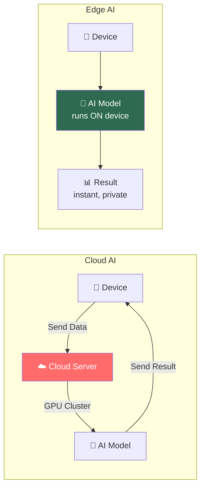
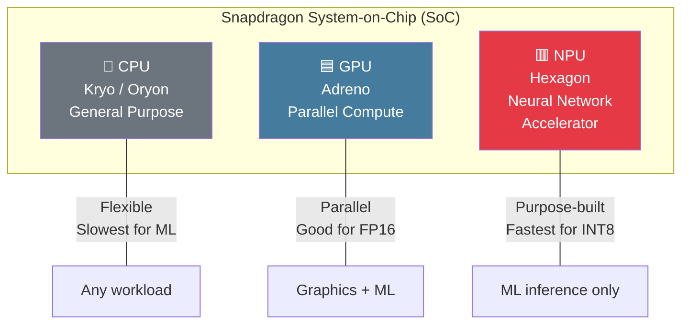
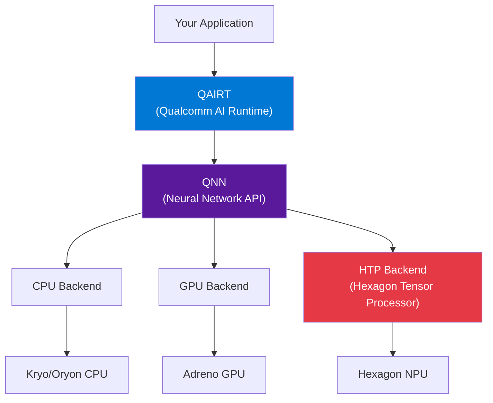

# Module 1 — Edge AI Fundamentals

| | |
|---|---|
| **Duration** | 15 minutes |
| **Goal** | Understand why edge AI exists and how Snapdragon enables it |
| **Prerequisites** | None |

---

## 🎯 Goal

Understand the fundamental concepts that make edge AI different from cloud AI, and why Snapdragon's hardware architecture matters for ML inference.

---

## Concepts

### Cloud AI vs Edge AI

| | Cloud AI | Edge AI |
|---|---|---|
| **Latency** | 50–500ms network round-trip | 1–50ms on-device |
| **Privacy** | Data leaves the device | Data stays on device |
| **Cost** | Pay per inference (GPU hours) | Free after deployment |
| **Connectivity** | Requires internet | Works offline |
| **Power** | Cloud pays the power bill | Must be battery-efficient |
| **Throughput** | Unlimited (add more GPUs) | Limited by device capability |

**When to use Edge AI:**
- Real-time responses needed (camera, voice, AR)
- Privacy-sensitive data (medical, financial, personal)
- Offline operation required
- High volume of inferences (cost savings)
- Power/bandwidth constrained environments

---

### CPU vs GPU vs NPU

Your Snapdragon chip has **three** different compute units that can run AI models:

| | CPU (Kryo/Oryon) | GPU (Adreno) | NPU (Hexagon) |
|---|---|---|---|
| **Design** | General-purpose | Parallel compute | ML-specific |
| **Best at** | Sequential logic, OS | Graphics, FP16 math | INT8/INT16 neural nets |
| **ML speed** | 1× (baseline) | 3–10× faster | 5–50× faster |
| **Power** | Highest per inference | Medium | Lowest per inference |
| **Precision** | FP32 | FP32, FP16 | INT4, INT8, INT16, FP16 |
| **Flexibility** | Any operation | Parallel operations | Neural network ops |

---

### Why NPUs Exist

CPUs are like **Swiss Army knives** — they can do anything, but nothing is optimized.

NPUs are like **dedicated assembly lines** — they do one thing (matrix multiply + activation functions) extremely fast and power-efficiently.

A single neural network inference involves billions of **multiply-accumulate (MAC)** operations. NPUs have thousands of MAC units running in parallel, specifically wired for the data flow patterns that neural networks need.

**Key insight:** The NPU doesn't just run the same code faster. It runs **different code** — compiled specifically for its architecture by Qualcomm's tools.

---

### The Qualcomm AI Engine

The **Qualcomm AI Engine** is the full system that coordinates AI workloads across all compute units:

- **QAIRT** = Qualcomm AI Runtime (the unified SDK)
- **QNN** = Qualcomm Neural Networks (the execution API)
- **HTP** = Hexagon Tensor Processor (the NPU compute unit)

You don't need to understand all of this now. We'll explore each layer in Modules 5–6.

---

### Memory and Performance on Edge

Edge devices have **constrained resources** compared to cloud servers:

| Resource | Cloud GPU Server | Snapdragon Phone |
|---|---|---|
| RAM | 64–256 GB | 8–16 GB |
| AI Accelerator Memory | 24–80 GB (GPU VRAM) | Shared system RAM |
| Power Budget | 300–700W | 3–8W |
| Storage | Terabytes | 128–512 GB |

**This means:**
- Models must be **small** (MobileNetV2 = 14 MB, not GPT-4 = 1.7 TB)
- **Quantization** (FP32 → INT8) is critical — 4× memory reduction
- **Memory bandwidth** is often the bottleneck, not compute
- Every watt matters — NPU uses 10× less power than CPU for the same inference

---

## Checkpoint

You should now understand:

- [x] Cloud AI vs Edge AI tradeoffs
- [x] What CPU, GPU, and NPU are
- [x] Why NPUs exist (efficiency, not just speed)
- [x] Why memory and power constrain edge AI
- [x] The basic Qualcomm software stack (QAIRT → QNN → Hexagon)

---

## ⏭️ Next Step

Continue to **[Module 2 — Environment Setup](02-setup.md)**
