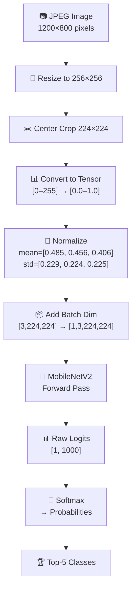

# Module 3 — Run the Model Locally

| | |
|---|---|
| **Duration** | 15 minutes |
| **Goal** | Run MobileNetV2 on your local CPU to understand what the model does |
| **Prerequisites** | Module 2 completed (environment set up) |

---

## 🎯 Goal

Before we optimize anything, we need to understand what our model does. In this module, you'll run a pre-trained image classifier on your development machine's CPU.

```
Input Image (dog.jpg)
      ↓
MobileNetV2 (PyTorch, CPU)
      ↓
"golden retriever" (96.2%)
```

---

## Concepts

### What is MobileNetV2?

MobileNetV2 is an image classification model designed by Google specifically for **mobile and edge devices**. It classifies images into 1,000 ImageNet categories (dog breeds, vehicles, objects, etc.).

| Property | Value |
|---|---|
| Parameters | 3.4 million |
| Model size | ~14 MB (FP32) |
| Input | 224×224 RGB image |
| Output | 1,000 class probabilities |
| Top-1 Accuracy | 71.9% on ImageNet |

**Why MobileNetV2 for this workshop?**
- Small enough to compile quickly on AI Hub
- Fast enough to benchmark meaningfully
- Accurate enough to see real results
- Widely supported by all Qualcomm tools

---

## Step 1: Run Local Inference

```bash
python src/01_local_inference.py
```

**What this does:**
1. Downloads a sample image (a Labrador retriever)
2. Loads MobileNetV2 with pre-trained ImageNet weights
3. Preprocesses the image (resize to 224×224, normalize)
4. Runs inference on your CPU
5. Prints the top-5 predictions

**Expected output:**
```
======================================================================
 Module 3 — Local Inference with MobileNetV2
======================================================================

Step 1: Preparing sample data
  ⬇ Downloading sample image...
  ✓ Saved to models/sample_image.jpg
  ⬇ Downloading ImageNet labels...
  ✓ Saved to models/imagenet_classes.txt

Step 2: Loading MobileNetV2 (pre-trained on ImageNet)
  ✓ Model loaded successfully
  ℹ Parameters: 3,504,872
  ℹ Model size: ~13.4 MB

Step 3: Preprocessing image
  ✓ Input shape: [1, 3, 224, 224]
  ℹ Shape meaning: [batch=1, channels=3, height=224, width=224]

Step 4: Running inference on CPU
  ✓ Inference completed in 45.2 ms

Step 5: Results
--------------------------------------------------
  Rank   Class                          Confidence
  ——     ————————————————————————————   ————————
  1      Labrador retriever                  87.23%
  2      golden retriever                     8.41%
  3      kuvasz                               0.82%
  4      tennis ball                          0.31%
  5      flat-coated retriever                0.28%
--------------------------------------------------
```

> **Note:** Your latency and exact confidence scores may vary depending on your CPU.

---

## Verify

Check that these files were created:

```bash
ls models/sample_image.jpg
ls models/imagenet_classes.txt
```

Both files should exist.

---

## What's Happening?

Let's trace exactly what happens inside the script:



1. **Resize + Crop:** ImageNet models expect exactly 224×224 input
2. **Normalize:** Subtract the mean and divide by std of the ImageNet training set — this is how the model was trained, so we must match it
3. **Batch dimension:** PyTorch models expect `[batch, channels, height, width]` — even for a single image, we add `batch=1`
4. **Forward pass:** The model computes ~300 million multiply-add operations
5. **Softmax:** Converts raw scores into probabilities that sum to 1.0

---

## Try It Yourself

Modify `src/01_local_inference.py` to classify your own image:

```python
# Change this line:
SAMPLE_IMAGE_PATH = Path("models/sample_image.jpg")

# To your own image:
SAMPLE_IMAGE_PATH = Path("path/to/your/image.jpg")
```

Then re-run:
```bash
python src/01_local_inference.py
```

---

## Common Problems

### Problem: "SSL: CERTIFICATE_VERIFY_FAILED" during download

**Fix:** Run this first:
```bash
pip install certifi
```
Or download the sample image manually from a browser.

### Problem: Very slow first run

**Cause:** PyTorch downloads model weights (~14 MB) on first use.

**Fix:** This is normal. Subsequent runs will be fast because the weights are cached in `~/.cache/torch/hub/`.

---

## Checkpoint

- [x] Script runs without errors
- [x] You see top-5 predictions with confidence scores
- [x] The top prediction makes sense for the image
- [x] You understand the preprocessing pipeline

---

## ⏭️ Next Step

Continue to **[Module 4 — Model Formats](04-model-formats.md)**
