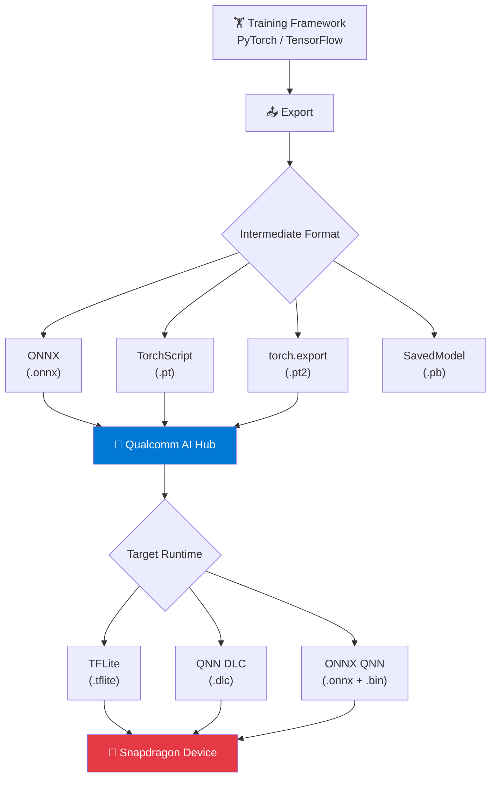

# Module 4 — Model Formats

| | |
|---|---|
| **Duration** | 15 minutes |
| **Goal** | Export MobileNetV2 to ONNX and understand the model format journey |
| **Prerequisites** | Module 3 completed |

---

## 🎯 Goal

Learn why we need to export models from PyTorch, what ONNX is, and how models travel from a training framework to Qualcomm hardware.

---

## Concepts

### The Model Format Journey



**Why can't Snapdragon just run PyTorch models?**

PyTorch models are Python objects with Python logic. Snapdragon hardware doesn't run Python. We need to:

1. **Export** the computation graph from Python into a static format
2. **Optimize** the graph for the target hardware (fuse operations, optimize memory layout)
3. **Compile** to native code that the NPU/GPU/CPU can execute

---

### What is ONNX?

**ONNX** (Open Neural Network Exchange) is an open standard for representing ML models. Think of it as a **universal translator** between training frameworks and inference runtimes.

| Property | Value |
|---|---|
| Full name | Open Neural Network Exchange |
| File extension | `.onnx` |
| Supported by | PyTorch, TensorFlow, Qualcomm, NVIDIA, Intel, Microsoft |
| Contains | Computation graph + trained weights |
| Format | Protocol Buffers (binary) |

ONNX is the **most widely supported** interchange format for Qualcomm tools.

---

### Formats Qualcomm AI Hub Accepts

| Format | Source | Notes |
|---|---|---|
| **ONNX** (`.onnx`) | PyTorch, TensorFlow, sklearn | Most widely supported |
| **torch.export** (`.pt2`) | PyTorch 2.x | Modern path, good for ExecuTorch |
| **TorchScript** (`.pt`) | PyTorch | Legacy, still supported |
| **TFLite** (`.tflite`) | TensorFlow Lite | For TF-based models |

### Formats Qualcomm AI Hub Produces

| Format | Runtime | Best For |
|---|---|---|
| **TFLite** (`.tflite`) | TensorFlow Lite + Qualcomm delegate | Android apps |
| **QNN DLC** (`.dlc`) | QNN / QAIRT | Maximum control, all platforms |
| **ONNX + QNN** (`.onnx`) | ONNX Runtime + QNN EP | Windows apps |

---

## Step 1: Export the Model

```bash
python src/02_export_model.py
```

**Expected output:**
```
======================================================================
 Module 4 — Model Export to ONNX and torch.export
======================================================================

Step 1: Loading MobileNetV2
  ✓ Model loaded

Step 2: Exporting to ONNX
  Exporting to ONNX...
  ✓ ONNX model saved to: models/exported/mobilenet_v2.onnx
  ℹ File size: 13.6 MB

Step 3: Validating ONNX model
  Validating ONNX model...
  ✓ ONNX model is valid!
  ℹ IR version: 9
  ℹ Opset version: 13
  ℹ Number of nodes: 152
  ℹ Input 'input': shape=['batch_size', 3, 224, 224]
  ℹ Output 'output': shape=['batch_size', 1000]

Step 4: Exporting with torch.export (optional)
  Exporting with torch.export (PyTorch 2.x)...
  ✓ torch.export model saved to: models/exported/mobilenet_v2_exported.pt2
  ℹ File size: 14.1 MB
```

---

## Verify

```bash
ls models/exported/
```

You should see:
```
mobilenet_v2.onnx
mobilenet_v2_exported.pt2
```

---

## What's Happening?

### ONNX Export (`torch.onnx.export`)

```python
torch.onnx.export(
    model,                    # The PyTorch model
    dummy_input,              # Example input — PyTorch traces the model with this
    "model.onnx",             # Output path
    opset_version=13,         # ONNX operator set (13 is widely compatible)
    input_names=["input"],    # Name the input tensor
    output_names=["output"],  # Name the output tensor
)
```

PyTorch **traces** the model by running the example input through it and recording every operation. The result is a static computation graph stored in ONNX format.

### Key ONNX export parameters explained:

- **`opset_version=13`**: Which version of ONNX operators to use. Version 13 is stable and widely supported by Qualcomm tools. Higher versions add newer operators.
- **`do_constant_folding=True`**: Pre-computes operations where all inputs are constants. Makes the graph smaller and faster.
- **`dynamic_axes`**: Allows the batch size to vary at runtime (important for flexibility).

---

## Common Problems

### Problem: "Unsupported operator" during ONNX export

**Symptom:** `RuntimeError: Exporting the operator 'xxx' to ONNX opset version 13 is not supported`

**Fix:** Try a higher opset version:
```python
torch.onnx.export(model, dummy_input, "model.onnx", opset_version=17)
```

### Problem: torch.export fails

**Symptom:** `torch.export.export() failed`

**Cause:** torch.export requires PyTorch 2.4+ and some models have dynamic control flow that it can't handle.

**Fix:** This is OK — ONNX export is the primary path. torch.export is optional.

---

## Checkpoint

- [x] `models/exported/mobilenet_v2.onnx` exists
- [x] ONNX validation passed
- [x] You understand why models need to be exported from PyTorch
- [x] You understand what ONNX is

---

## ⏭️ Next Step

Continue to **[Module 5 — Qualcomm AI Hub](05-ai-hub.md)**
