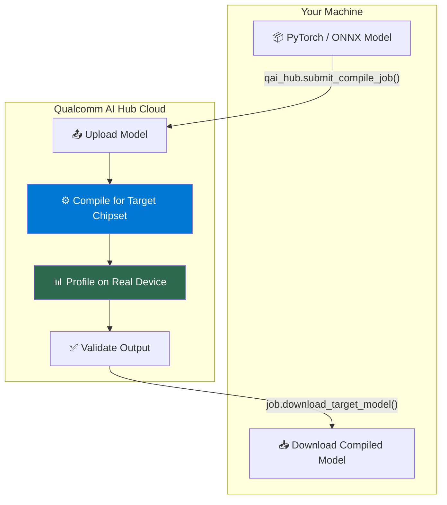
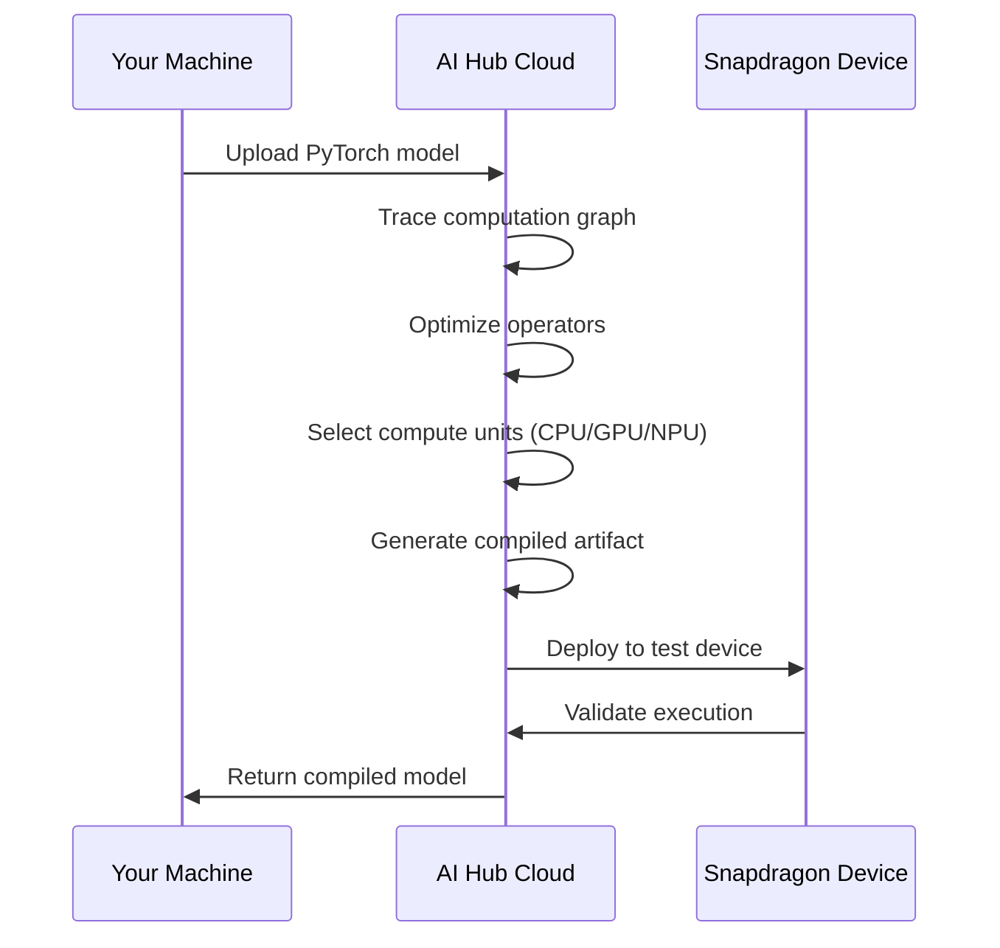

# Module 5 — Qualcomm AI Hub

| | |
|---|---|
| **Duration** | 30 minutes |
| **Goal** | Use AI Hub to compile, profile, and validate your model on real Snapdragon hardware |
| **Prerequisites** | Module 4 completed, AI Hub account configured |

---

## 🎯 Goal

This is the **most important module** in the workshop. You'll use Qualcomm AI Hub to take your PyTorch model and compile it for a real Snapdragon device — all from the cloud.

```
PyTorch Model
      ↓
  AI Hub Cloud
      ↓
Compiled for Snapdragon 8 Gen 3
      ↓
Profiled on Real Device
      ↓
Performance Report
```

---

## Concepts

### What is Qualcomm AI Hub?

Qualcomm AI Hub is a **cloud service** that lets you:

1. **Compile** models for specific Snapdragon chipsets
2. **Profile** models on real physical devices (in Qualcomm's device farm)
3. **Validate** model outputs for correctness
4. **Download** optimized models ready for deployment



### AI Hub Ecosystem

| Component | Purpose |
|---|---|
| **AI Hub Models** | Pre-optimized model library (100+ models) |
| **AI Hub Workbench** | Compile/profile your own models (BYOM) |
| **AI Hub Apps** | Sample applications with integration code |
| **GenieX** | LLM runtime with AI Hub model support |

### Why AI Hub exists

Without AI Hub, deploying to Snapdragon would require:
- Downloading the 10+ GB QAIRT SDK
- Setting up a complex C++ build environment
- Manually converting models through multiple tools
- Having physical hardware for every test

AI Hub reduces this to a **single Python API call**.

---

## Step 1: Verify AI Hub Connection

```bash
qai-hub list-devices
```

**Expected output (sample):**
```
Samsung Galaxy S23 (Family)
Samsung Galaxy S24 (Family)
Samsung Galaxy S25 (Family)
QCS6490 (Proxy)
QCS8550 (Proxy)
Snapdragon X Elite CRD
Snapdragon 8 Elite QRD
...
```

Each of these is a **real physical device** in Qualcomm's cloud device farm.

---

## Step 2: Browse Available Models

AI Hub has 100+ pre-optimized models. Browse them:

```bash
# List all available models
qai-hub-models models
```

Or explore specific models:

```bash
# Get info about MobileNetV2
qai-hub-models info mobilenet_v2
```

**Expected output:**
```
Model: MobileNet-v2
Task: Image Classification
Framework: PyTorch
Supported Runtimes: tflite, qnn
Supported Devices: Samsung Galaxy S23, S24, S25, ...
```

---

## Step 3: Compile Your Model

Run the compilation script:

```bash
python src/03_compile_model.py
```

**What happens behind the scenes:**



**Expected output:**
```
======================================================================
 Module 5 — Qualcomm AI Hub: Compile for Snapdragon
======================================================================

Step 1: Checking Qualcomm AI Hub connection
  ✓ Connected to Qualcomm AI Hub
  ℹ 25 target devices available

Step 2: Available target devices
  Sample target devices:
    • Samsung Galaxy S23 (Family)
    • Samsung Galaxy S24 (Family)
    • Samsung Galaxy S25 (Family)
    ...

Step 3: Compiling MobileNetV2 for Snapdragon
  Loading MobileNetV2...
  Exporting model with torch.export...
  Target device: Samsung Galaxy S24 (Family)
  Submitting compilation job to AI Hub...
  ⏳ This may take 2–5 minutes...

  ℹ Job ID: jXYZ123abc
  ℹ Dashboard: https://app.aihub.qualcomm.com/jobs/jXYZ123abc/

  Status: CompileJobStatus.SUCCESS
  ✓ Compiled model saved to: models/compiled/mobilenet_v2_compiled.tflite
  ℹ Compiled size: 3.5 MB
```

> **Note the size reduction!** The original FP32 model was ~14 MB. The compiled TFLite model is ~3.5 MB because AI Hub optimizes the model structure.

---

## Step 4: View the Job on the Dashboard

Open the dashboard URL printed by the script:

```
https://app.aihub.qualcomm.com/jobs/YOUR_JOB_ID/
```

The dashboard shows:
- Compilation status
- Target device details
- Model architecture visualization
- Per-layer compute unit assignment
- Warnings or unsupported operators (if any)

---

## Step 5: Profile on Real Hardware

```bash
python src/04_profile_model.py
```

This submits a **profiling job** that runs your compiled model on a real Snapdragon device and returns performance metrics.

**Expected output:**
```
Step 1: Profiling compiled model on real hardware
  Submitting profiling job...
  Target: Samsung Galaxy S24 (Family)
  ⏳ Waiting for a device in the farm (1–5 minutes)...

  ℹ Job ID: pXYZ456def
  Status: ProfileJobStatus.SUCCESS

Step 2: Profile results
  --------------------------------------------------
  Total inference time: 2.3 ms
  Compute units: 85% NPU, 10% GPU, 5% CPU
  Peak memory: 12.4 MB
  --------------------------------------------------
```

---

## Step 6: Using the AI Hub CLI (Alternative)

You can also compile and profile using the `qai-hub-models` CLI:

```bash
# Export and compile MobileNetV2 for a specific device
qai-hub-models export mobilenet_v2 \
    --target-runtime tflite \
    --device "Samsung Galaxy S24 (Family)"
```

This is a one-command shortcut that handles export + compile + download.

---

## What's Happening?

### The Compilation Process

When AI Hub compiles your model, it performs these optimizations:

1. **Graph optimization**: Fuses operations (Conv+BN+ReLU → single fused op)
2. **Memory planning**: Optimizes tensor memory layout for the target hardware
3. **Operator mapping**: Assigns each operation to the best compute unit (CPU/GPU/NPU)
4. **Quantization** (if requested): Converts FP32 → INT8 for NPU acceleration
5. **Code generation**: Produces hardware-native code for the target chipset

### The Profiling Process

Profiling sends your compiled model to a **real physical device**:
1. The model is loaded onto the device
2. Sample inputs are generated
3. Inference runs multiple times (for statistical accuracy)
4. Per-layer timing is captured
5. Memory usage is measured
6. Results are sent back to you

---

## Common Problems

### Problem: "Device not available" during profiling

**Symptom:** Job stays in PENDING state for a long time.

**Cause:** The requested device is busy in the device farm.

**Fix:** Try a different device:
```python
device = hub.Device("Samsung Galaxy S23 (Family)")  # Try another device
```

### Problem: "Compilation failed — unsupported operator"

**Symptom:** `CompileJobStatus.FAILED` with "unsupported op" message.

**Cause:** Some PyTorch operations can't be mapped to the target runtime.

**Fix:** Check the AI Hub dashboard for details. Common fixes:
- Use a different `opset_version` in ONNX export
- Try a different target runtime (`qnn_dlc` instead of `tflite`)
- Simplify custom operations in the model

### Problem: API rate limiting

**Symptom:** `Error: Rate limit exceeded`

**Cause:** Free tier has limited concurrent jobs.

**Fix:** Wait a few minutes and retry. AI Hub automatically queues jobs.

---

## Checkpoint

- [x] `models/compiled/mobilenet_v2_compiled.tflite` exists
- [x] Compilation job succeeded
- [x] You viewed the job on the AI Hub dashboard
- [x] You understand that compilation happens in the cloud
- [x] You understand that profiling runs on real hardware

---

## ⏭️ Next Step

Continue to **[Module 6 — QAIRT + QNN](06-qairt-qnn.md)**
