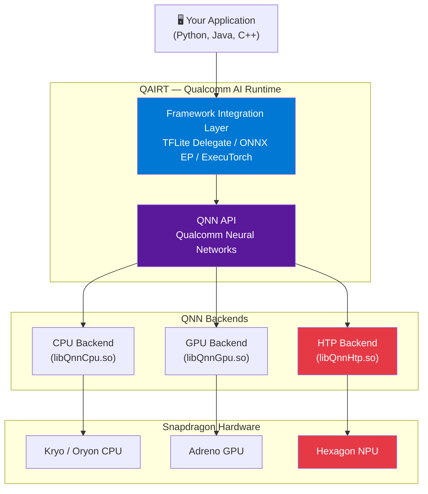
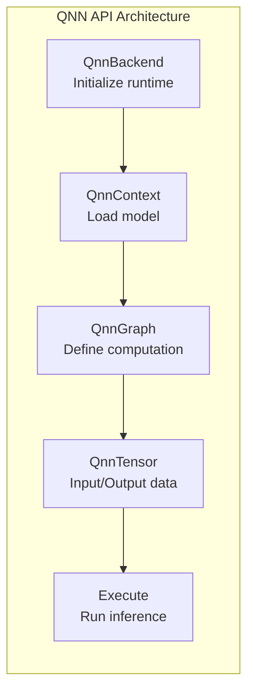
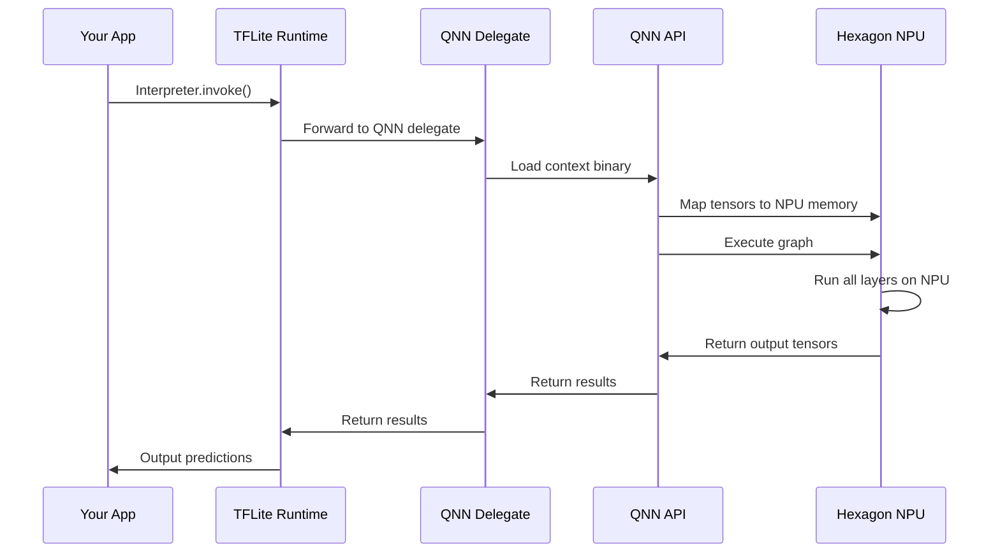

# Module 6 — QAIRT + QNN Deep Dive

| | |
|---|---|
| **Duration** | 20 minutes |
| **Goal** | Understand what happens between your application and the Snapdragon hardware |
| **Prerequisites** | Module 5 completed |

---

## 🎯 Goal

Understand the Qualcomm runtime stack — QAIRT and QNN — so you know what's happening when your model runs on a Snapdragon device.

---

## Concepts

### The Full Runtime Stack

When your application runs inference on a Snapdragon device, the request passes through several layers:



---

### What is QAIRT?

**QAIRT** (Qualcomm AI Runtime) is the **unified SDK** that contains everything you need to deploy AI models on Qualcomm hardware. It replaced and unified two older SDKs:

| Component | Previously Known As | Purpose |
|---|---|---|
| **QNN** | AI Engine Direct | Low-level neural network execution API |
| **SNPE** | Snapdragon Neural Processing Engine | Older SDK (now deprecated in favor of QNN) |

**QAIRT = QNN + tools + converters + runtime libraries**

Think of QAIRT as the **toolbox** and QNN as the **engine inside the toolbox**.

---

### What is QNN?

**QNN** (Qualcomm Neural Networks) is the low-level API that actually executes neural networks on Qualcomm hardware.



#### QNN Key Concepts

| Concept | What It Is |
|---|---|
| **Backend** | The compute unit to use (CPU, GPU, or HTP/NPU) |
| **Context** | A loaded instance of a compiled model |
| **Graph** | The computation graph (operations and their connections) |
| **Tensor** | Input/output data containers |
| **Context Binary** | Pre-compiled model for a specific backend (`.bin`) |

#### QNN Backends

QNN supports three backends, each mapping to different Snapdragon hardware:

| Backend | Library | Hardware | Best For |
|---|---|---|---|
| `QnnCpu` | `libQnnCpu.so` | Kryo/Oryon CPU cores | Fallback, debugging |
| `QnnGpu` | `libQnnGpu.so` | Adreno GPU | FP16 parallel workloads |
| `QnnHtp` | `libQnnHtp.so` | Hexagon Tensor Processor (NPU) | INT8 quantized models ⚡ |

**HTP** (Hexagon Tensor Processor) is the "NPU backend" — this is where quantized models run fastest.

---

### QAIRT vs QNN — The Analogy

Think of it like driving a car:

| | QAIRT | QNN |
|---|---|---|
| **Analogy** | The entire car (engine + steering + dashboard) | The engine specifically |
| **Level** | High-level SDK with tools, converters, runtime | Low-level execution API |
| **User** | Application developer | Runtime/framework developer |
| **Access** | Through framework delegates (TFLite, ONNX RT) | Direct C/C++ API calls |

**Most developers use QAIRT through framework delegates** (TFLite, ONNX Runtime) and never call QNN directly. But understanding QNN helps you debug performance issues.

---

### How a Model Executes on the NPU

Let's trace what happens when you run inference with a TFLite model compiled for Snapdragon:



1. **Your app** calls the TFLite interpreter (or ONNX Runtime)
2. **TFLite** delegates supported operations to the **QNN delegate**
3. The **QNN delegate** loads the pre-compiled **context binary**
4. **QNN** sends the model and input data to the **Hexagon NPU**
5. The NPU executes all operations in hardware
6. Results flow back up through the stack

**Key insight:** The compiled model (from AI Hub) contains a **context binary** — pre-compiled NPU instructions. The NPU doesn't "interpret" your model; it runs native code.

---

### Framework Delegates

You don't have to use QNN directly. Instead, use a **delegate** from your preferred framework:

| Framework | Delegate | Platform | Install |
|---|---|---|---|
| **TensorFlow Lite** | QNN Delegate | Android, Linux | Built into TFLite runtime |
| **ONNX Runtime** | QNN Execution Provider | Windows, Linux | `pip install onnxruntime-qnn` |
| **ExecuTorch** | QNN Backend | Android, Linux | Part of ExecuTorch |

```python
# Example: TFLite with QNN Delegate (conceptual)
import tflite_runtime.interpreter as tflite

interpreter = tflite.Interpreter(
    model_path="mobilenet_v2_compiled.tflite",
    experimental_delegates=[
        tflite.load_delegate("libQnnTFLiteDelegate.so")
    ]
)
interpreter.allocate_tensors()
interpreter.invoke()
```

```python
# Example: ONNX Runtime with QNN EP (conceptual)
import onnxruntime as ort

session = ort.InferenceSession(
    "model.onnx",
    providers=["QNNExecutionProvider"]
)
output = session.run(None, {"input": input_data})
```

---

### QAIRT SDK Components

If you install the full QAIRT SDK (not required for this workshop), you get:

```
qairt-sdk/
├── bin/
│   ├── qnn-model-converter        # Convert models to QNN format
│   ├── qnn-context-binary-generator # Generate NPU context binaries
│   ├── qnn-net-run                 # Run inference from command line
│   └── qnn-profile-viewer          # View profiling data
├── lib/
│   ├── libQnnCpu.so               # CPU backend
│   ├── libQnnGpu.so               # GPU backend
│   ├── libQnnHtp.so               # NPU backend
│   └── libQnnSystem.so            # System utilities
├── examples/
│   └── QNN/SampleApp/             # Reference C++ application
└── docs/
    └── QNN/                       # API documentation
```

> **For this workshop, AI Hub handles all of this for you.** The QAIRT SDK is for advanced users who need full control.

---

## What's Happening Under the Hood?

When AI Hub compiled your MobileNetV2 model in Module 5, it did this:

```
1. Received your PyTorch model
2. Converted to an intermediate representation
3. Mapped each operation to a QNN operator:
   - Conv2d → QnnConv2d (runs on NPU)
   - BatchNorm → fused into Conv2d
   - ReLU6 → fused into Conv2d
   - Global AvgPool → QnnPoolAvg2d (runs on NPU)
   - Linear → QnnFullyConnected (runs on NPU)
4. Generated a QNN context binary for the HTP backend
5. Wrapped it in a TFLite model with QNN delegate metadata
6. The .tflite file contains the context binary inside it
```

This is why the compiled model is **much smaller** and **much faster** — operations are fused, quantized, and pre-compiled for the specific hardware.

---

## Common Problems

### Problem: "Missing QNN shared libraries"

**Symptom:** `Error: cannot find libQnnHtp.so`

**Cause:** Running on a device without Qualcomm runtime libraries installed.

**Fix:** The QNN libraries come pre-installed on Snapdragon devices. If deploying manually, include the libraries from the QAIRT SDK in your application's lib directory.

### Problem: "Model falls back to CPU"

**Symptom:** Inference works but is slow — profiling shows 100% CPU usage.

**Cause:** Some operations aren't supported on the NPU, forcing a fallback.

**Fix:**
1. Check the AI Hub compilation report for unsupported operators
2. Try a different model architecture
3. Use quantization — some ops only run on NPU when quantized

---

## Checkpoint

- [x] You understand the QAIRT → QNN → Backend → Hardware stack
- [x] You know the difference between QAIRT (SDK) and QNN (API)
- [x] You understand the three backends: CPU, GPU, HTP (NPU)
- [x] You know what a "context binary" is
- [x] You understand that AI Hub handles the QNN compilation for you

---

## ⏭️ Next Step

Continue to **[Module 7 — GenieX](07-geniex.md)**
