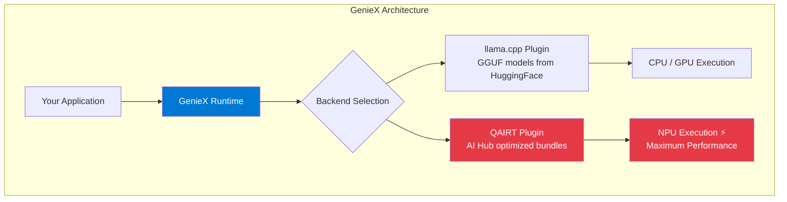
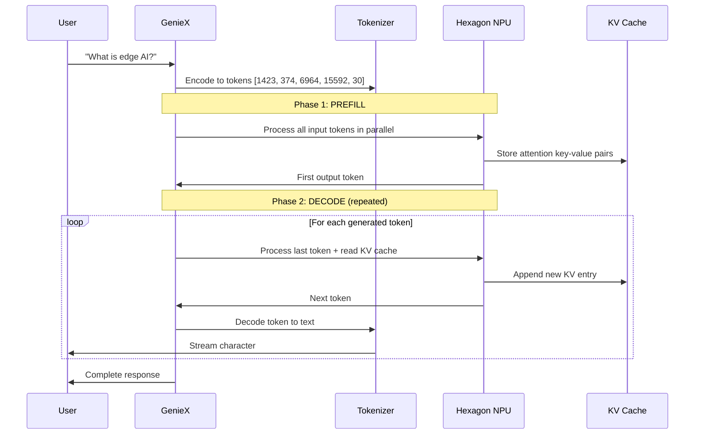

# Module 7 — GenieX: On-Device LLM Inference

| | |
|---|---|
| **Duration** | 20 minutes |
| **Goal** | Understand on-device LLM inference and run a model with GenieX |
| **Prerequisites** | Module 6 concepts understood |
| **Hardware** | Snapdragon device recommended (optional — concepts work without it) |

---

## 🎯 Goal

Learn how Large Language Model inference differs from traditional ML, and use GenieX to run an LLM directly on Snapdragon hardware.

---

## Concepts

### Why LLM Inference is Different

Image classification (MobileNetV2) and LLM text generation (Qwen, Llama) are fundamentally different workloads:

| | Image Classification | LLM Text Generation |
|---|---|---|
| **Execution** | Single forward pass | Many sequential passes |
| **Input** | Fixed size (224×224) | Variable length (tokens) |
| **Output** | Fixed size (1000 classes) | Variable length (generated text) |
| **Bottleneck** | Compute (FLOPS) | Memory bandwidth (weight loading) |
| **Model size** | 3–100 MB | 1–70 GB |
| **Latency pattern** | Constant | Two-phase (prefill + decode) |

### What is GenieX?

**GenieX** is Qualcomm's open-source on-device generative AI runtime. It provides a simple API for running LLMs and Vision-Language Models on Snapdragon devices.



| Feature | llama.cpp Plugin | QAIRT Plugin |
|---|---|---|
| **Model source** | HuggingFace GGUF | Qualcomm AI Hub bundles |
| **Setup** | Easy — download & run | Requires pre-compiled bundle |
| **Performance** | Good (CPU/GPU) | Best (NPU-accelerated) ⚡ |
| **Supported models** | Any GGUF model | Selected AI Hub models |

---

## Step 1: Run the GenieX Demo

```bash
python src/07_geniex_demo.py
```

This script will:
- Explain LLM inference concepts (prefill, decode, KV cache)
- If GenieX is installed: run a real LLM on your device
- If not installed: show the code and explain what would happen

---

## Step 2: GenieX CLI (if on Snapdragon)

The GenieX CLI is the fastest way to try on-device LLMs:

```bash
# Interactive chat with a GGUF model from HuggingFace
geniex infer unsloth/Qwen3-0.6B-GGUF

# Use an AI Hub optimized model (best performance)
geniex infer ai-hub-models/Qwen3-4B

# Start a local OpenAI-compatible server
geniex pull ai-hub-models/Qwen3-4B
geniex serve
# Server at http://127.0.0.1:18181
```

---

## Step 3: GenieX Python API (if on Snapdragon)

```python
from geniex import AutoModelForCausalLM

# Load a model (downloads automatically on first use)
model = AutoModelForCausalLM.from_pretrained(
    "unsloth/Qwen3-0.6B-GGUF",
    precision="Q4_0",  # 4-bit quantization
)

# Chat-style generation
messages = [
    {"role": "system", "content": "You are a helpful assistant."},
    {"role": "user", "content": "Explain edge AI in one sentence."},
]

response = model.generate(messages)
print(response)
```

---

## Step 4: Using GenieX as an OpenAI-Compatible Server

GenieX can start a local server that speaks the OpenAI API protocol:

```bash
# Pull and serve a model
geniex pull ai-hub-models/Qwen3-4B
geniex serve
```

Then connect from any OpenAI-compatible client:

```python
from openai import OpenAI

# Point to local GenieX server
client = OpenAI(
    base_url="http://127.0.0.1:18181/v1",
    api_key="not-needed",
)

response = client.chat.completions.create(
    model="ai-hub-models/Qwen3-4B",
    messages=[{"role": "user", "content": "What is Snapdragon?"}],
)
print(response.choices[0].message.content)
```

This means you can use **LangChain**, **LlamaIndex**, or any OpenAI-compatible tool with a local Snapdragon LLM — with zero cloud costs and full privacy.

---

## What's Happening?

### LLM Inference Architecture



### LLM Performance Metrics

| Metric | What It Measures | Typical Values (on Snapdragon) |
|---|---|---|
| **TTFT** (Time to First Token) | Prefill latency | 200ms–2s |
| **Decode speed** (tok/s) | Token generation throughput | 10–60 tok/s |
| **Context length** | Maximum input size | 2K–8K tokens |
| **Memory usage** | RAM consumed by model + KV cache | 1–8 GB |

---

## Common Problems

### Problem: "GenieX not found"

**Fix:** GenieX requires a Snapdragon device. If you're on an x86 machine, you can't run GenieX locally. Use AI Hub's cloud profiling instead.

### Problem: "Out of memory" when loading a model

**Cause:** The model + KV cache exceeds available RAM.

**Fix:** Use a smaller model or more aggressive quantization:
```python
model = AutoModelForCausalLM.from_pretrained(
    "unsloth/Qwen3-0.6B-GGUF",  # Use 0.6B instead of 4B
    precision="Q4_0",             # 4-bit quantization
)
```

---

## Checkpoint

- [x] You understand prefill vs decode phases
- [x] You understand what the KV cache is and why it matters
- [x] You've seen the GenieX API (Python + CLI + OpenAI server)
- [x] You understand the two backends (llama.cpp vs QAIRT)

---

## ⏭️ Next Step

Continue to **[Module 8 — Deploy to Device](08-deployment.md)**
