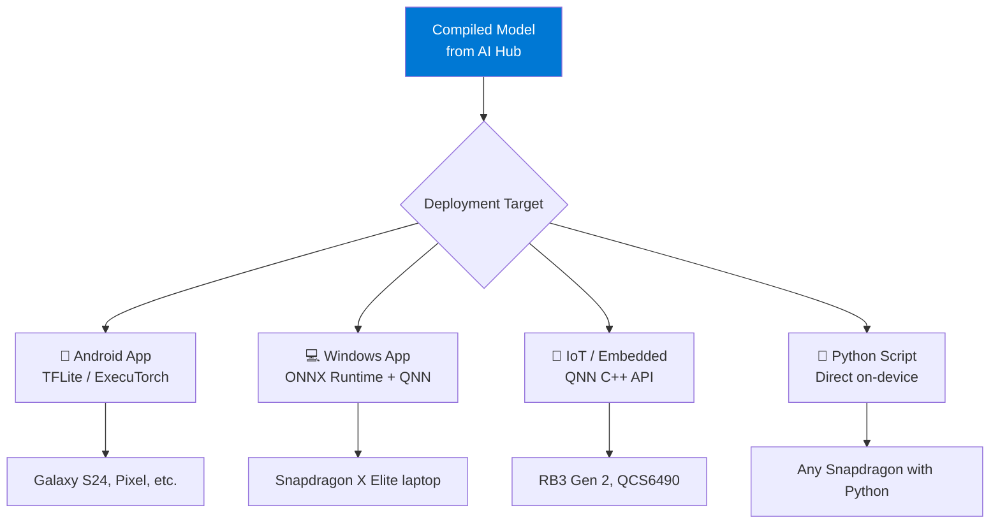
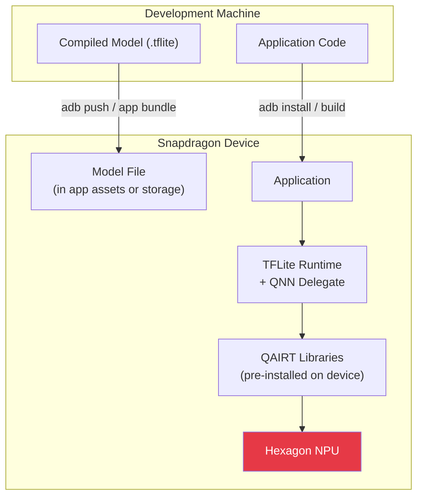

# Module 8 — Deploy to Device

| | |
|---|---|
| **Duration** | 20 minutes |
| **Goal** | Deploy the compiled model to a Snapdragon device |
| **Prerequisites** | Module 5 completed (compiled model exists) |
| **Hardware** | Snapdragon device required for physical deployment |

---

## 🎯 Goal

Deploy your compiled MobileNetV2 model to a real Snapdragon device and run inference.

---

## Concepts

### Deployment Paths

There are multiple ways to deploy an AI model to a Snapdragon device:



---

## Path A: Deploy to Android (via ADB)

### Prerequisites

1. **Android device** with Snapdragon chipset
2. **USB debugging** enabled on the device
3. **ADB** installed on your development machine

### Step 1: Enable USB Debugging

On your Android device:
1. Go to **Settings → About Phone**
2. Tap **Build Number** 7 times (enables Developer Options)
3. Go to **Settings → Developer Options**
4. Enable **USB Debugging**
5. Connect device via USB

### Step 2: Verify ADB Connection

```bash
adb devices
```

**Expected output:**
```
List of devices attached
ABCDEF123456    device
```

### Step 3: Push the Model to Device

```bash
# Create a directory on the device
adb shell mkdir -p /data/local/tmp/workshop/

# Push the compiled model
adb push models/compiled/mobilenet_v2_compiled.tflite /data/local/tmp/workshop/

# Push a test image
adb push models/sample_image.jpg /data/local/tmp/workshop/
```

**Verify:**
```bash
adb shell ls -la /data/local/tmp/workshop/
```

### Step 4: Run Inference on Device

If you have the TFLite benchmark tool:

```bash
# Push the benchmark tool (download from TFLite releases)
adb push benchmark_model /data/local/tmp/workshop/
adb shell chmod +x /data/local/tmp/workshop/benchmark_model

# Run benchmark
adb shell /data/local/tmp/workshop/benchmark_model \
    --graph=/data/local/tmp/workshop/mobilenet_v2_compiled.tflite \
    --num_threads=4 \
    --use_gpu=false \
    --num_runs=50
```

**Expected output:**
```
Inference timings:
  Init: 12.3 ms
  Warmup: 5.1 ms
  Inference (avg): 2.3 ms
  Inference (std): 0.4 ms
```

---

## Path B: Deploy to Windows on Snapdragon

If you have a **Snapdragon X Elite/Plus** Windows laptop:

### Step 1: Install ONNX Runtime with QNN

```bash
pip install onnxruntime-qnn
```

### Step 2: Run Inference with QNN Execution Provider

```python
"""On-device inference using ONNX Runtime with QNN EP (Windows ARM64)"""
import numpy as np
import onnxruntime as ort
from PIL import Image
import torchvision.transforms as transforms

# Create session with QNN Execution Provider
session = ort.InferenceSession(
    "models/exported/mobilenet_v2.onnx",
    providers=["QNNExecutionProvider", "CPUExecutionProvider"],
    provider_options=[{"backend_path": "QnnHtp.dll"}, {}],
)

# Preprocess image
transform = transforms.Compose([
    transforms.Resize(256),
    transforms.CenterCrop(224),
    transforms.ToTensor(),
    transforms.Normalize(mean=[0.485, 0.456, 0.406], std=[0.229, 0.224, 0.225]),
])
image = Image.open("models/sample_image.jpg").convert("RGB")
input_data = transform(image).unsqueeze(0).numpy()

# Run inference
output = session.run(None, {"input": input_data})
predictions = np.argmax(output[0], axis=1)
print(f"Predicted class: {predictions[0]}")
```

---

## Path C: Deploy via AI Hub Sample Apps

Qualcomm provides sample applications on AI Hub. This is the easiest path for Android deployment:

```bash
# Browse sample apps
# Visit: https://aihub.qualcomm.com/apps

# Example: Download and build an image classification app
# that uses your compiled model
```

The AI Hub Apps repository contains complete Android projects with:
- Gradle build files
- Camera integration
- Model loading
- QNN delegate setup
- Result display

---

## Path D: Cloud-Only Deployment (No Hardware)

If you don't have Snapdragon hardware, you've already deployed and tested via AI Hub in Module 5:

```python
# This runs your model on a REAL device in Qualcomm's cloud
inference_job = hub.submit_inference_job(
    model=compiled_model_path,
    device=hub.Device("Samsung Galaxy S24 (Family)"),
    inputs={"image": sample_input},
)
output = inference_job.download_output_data()
```

This is a **real deployment** — your model ran on real hardware. The only difference is that the hardware is in Qualcomm's device farm instead of in your hands.

---

## Deployment Architecture



---

## Common Problems

### Problem: ADB says "unauthorized"

**Fix:** Check your phone — it should show a dialog asking "Allow USB debugging?" Tap **Allow**.

### Problem: "INSTALL_FAILED_NO_MATCHING_ABIS"

**Cause:** Your APK was built for the wrong architecture.

**Fix:** Ensure your build targets `arm64-v8a` (which is what Snapdragon uses).

### Problem: Model runs but is slow (CPU fallback)

**Cause:** QNN delegate libraries not found on the device.

**Fix:** Ensure the Qualcomm AI runtime libraries are available:
- On modern Snapdragon phones, they're pre-installed
- On dev kits, you may need to install the QAIRT SDK

---

## Checkpoint

- [x] You understand the different deployment paths
- [x] You know how to push models to Android via ADB
- [x] You understand that cloud deployment via AI Hub is also "real" deployment
- [x] You've seen the deployment architecture

---

## ⏭️ Next Step

Continue to **[Module 9 — Benchmarking](09-benchmarking.md)**
