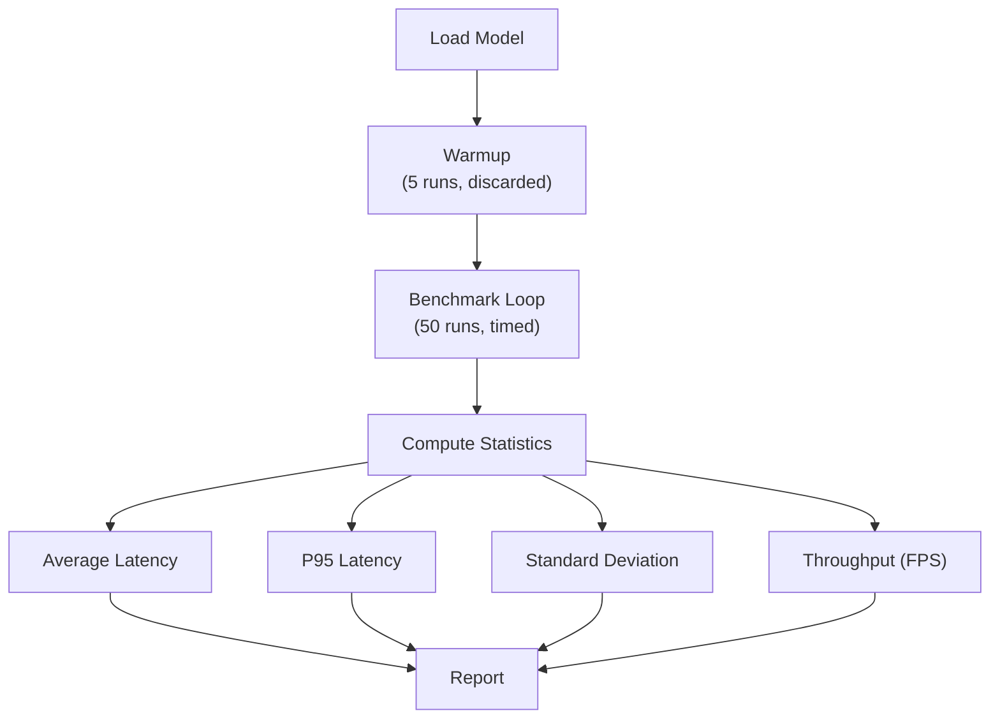

# Module 9 — Benchmarking

| | |
|---|---|
| **Duration** | 15 minutes |
| **Goal** | Measure performance and understand the metrics that matter |
| **Prerequisites** | Module 5 completed |

---

## 🎯 Goal

Learn to benchmark AI models systematically. Measure before you optimize — never assume.

---

## Concepts

### Performance Metrics for Edge AI

| Metric | What It Measures | Unit | Why It Matters |
|---|---|---|---|
| **Latency** | Time for one inference | milliseconds (ms) | User experience (responsiveness) |
| **Throughput** | Inferences per second | FPS | Batch processing, video |
| **TTFT** | Time to first token (LLMs) | milliseconds | Perceived responsiveness |
| **tok/s** | Tokens per second (LLMs) | tokens/second | Reading speed for generated text |
| **Memory** | RAM consumed by model + runtime | MB | Device constraints |
| **Power** | Energy per inference | mW or mJ | Battery life |
| **NPU utilization** | % of operations on NPU | percentage | Optimization effectiveness |

### Benchmarking Best Practices

1. **Warmup first** — The first few runs are always slower (model loading, cache warming)
2. **Run many iterations** — At least 50 runs for statistical significance
3. **Report P50 and P95** — Average alone hides tail latency
4. **Measure on target hardware** — Dev machine performance ≠ device performance
5. **Control variables** — Same input, same conditions, same device state

---

## Step 1: Run the Benchmark

```bash
python src/05_benchmark.py
```

**Expected output:**
```
======================================================================
 Module 9 — Benchmarking: Measure Before You Optimize
======================================================================

Step 1: Benchmarking on local CPU
  Loading model...
  Warming up (5 runs)...
  Benchmarking (50 runs)...
  ✓ Avg latency: 42.3 ms
  ✓ Throughput:  23.6 FPS

Step 2: Profiling on Snapdragon (via AI Hub)
  Submitting profile job for tflite...
  ✓ Profile data collected

Step 3: Benchmark Comparison
----------------------------------------------------------------------
+----------------------------+----------+----------+----------+---------+
| Backend                    | Avg (ms) | P95 (ms) | FPS      | Std Dev |
+----------------------------+----------+----------+----------+---------+
| Local CPU (PyTorch)        | 42.3     | 48.1     | 23.6     | ±3.2    |
| Snapdragon (tflite)        | 2.3      | 2.8      | 434.8    | ±0.3    |
+----------------------------+----------+----------+----------+---------+
----------------------------------------------------------------------
```

> **Note:** Your numbers will vary. Local CPU depends on your development machine. Snapdragon numbers come from AI Hub profiling.

---

## Step 2: Understand the Results

### Expected Performance Comparison

| Backend | Latency | Speedup | Notes |
|---|---|---|---|
| Development CPU (x86) | ~40–100 ms | 1× baseline | Running PyTorch on your laptop |
| Snapdragon CPU (Kryo) | ~15–25 ms | 2–5× | ARM CPU on device |
| Snapdragon GPU (Adreno) | ~5–10 ms | 5–15× | FP16 parallel compute |
| Snapdragon NPU (Hexagon) | ~1–3 ms | 15–50× | INT8 quantized, purpose-built |

### Why Is the NPU So Much Faster?

```
┌─────────────────────────────────────────────────────────────┐
│                    Why NPU Wins                              │
├─────────────────────────────────────────────────────────────┤
│                                                              │
│  CPU:   Sequential operations, general-purpose instructions  │
│         Each multiply-add requires fetch → decode → execute  │
│         ~few TOPS (Tera Operations Per Second)               │
│                                                              │
│  GPU:   Parallel operations, many small cores                │
│         Good at FP16 matrix math, shared with display        │
│         ~10–20 TOPS                                          │
│                                                              │
│  NPU:   Purpose-built for neural networks                    │
│         Thousands of MAC units wired for tensor operations   │
│         INT8 quantized math at full throughput                │
│         Dedicated memory path, no contention with display    │
│         ~40–75 TOPS (Snapdragon 8 Gen 3 / 8 Elite)          │
│                                                              │
│  TOPS = Tera Operations Per Second (10^12 operations/sec)    │
└─────────────────────────────────────────────────────────────┘
```

---

## Step 3: Review Saved Results

Results are saved to `benchmarks/results/benchmark_comparison.json`:

```bash
cat benchmarks/results/benchmark_comparison.json
```

```json
{
  "timestamp": "2025-01-15 14:30:00",
  "model": "MobileNetV2",
  "input_shape": [1, 3, 224, 224],
  "num_runs": 50,
  "results": [
    {
      "backend": "Local CPU (PyTorch)",
      "avg_latency_ms": 42.3,
      "p95_latency_ms": 48.1,
      "throughput_fps": 23.6
    }
  ]
}
```

---

## What's Happening?

The benchmark script measures:



---

## Common Problems

### Problem: Very inconsistent latency numbers

**Cause:** Other processes consuming CPU on your development machine.

**Fix:** Close heavy applications and re-run. Or increase `NUM_RUNS` to 200 for better averaging.

---

## Checkpoint

- [x] Benchmark ran successfully
- [x] You see a comparison between local CPU and Snapdragon
- [x] You understand why NPU is faster (dedicated hardware, quantized math)
- [x] Results are saved to `benchmarks/results/`

---

## ⏭️ Next Step

Continue to **[Module 10 — Optimization](10-optimization.md)**
