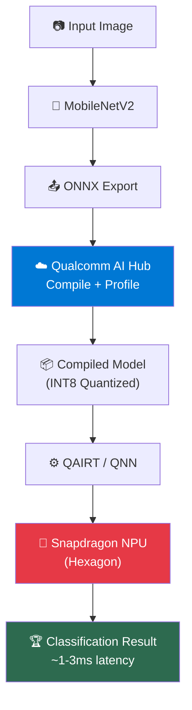

# Module 11 — Final Project & Next Steps

| | |
|---|---|
| **Duration** | 10 minutes |
| **Goal** | Review what you've built and explore next steps |
| **Prerequisites** | All previous modules |

---

## 🎯 Congratulations!

You've completed the Qualcomm Edge AI Workshop! 🎉

Here's what you built:



---

## What You Learned

| Module | Topic | Key Takeaway |
|---|---|---|
| 0 | Overview | The end-to-end Qualcomm Edge AI pipeline |
| 1 | Edge AI | CPU vs GPU vs NPU — why NPUs exist |
| 2 | Setup | Qualcomm AI Hub + Python environment |
| 3 | First Model | Running MobileNetV2 on CPU |
| 4 | Model Formats | ONNX as the interchange format |
| 5 | AI Hub | Cloud compilation + profiling on real devices |
| 6 | QAIRT + QNN | The runtime stack that executes models |
| 7 | GenieX | On-device LLM inference |
| 8 | Deployment | Getting models onto Snapdragon devices |
| 9 | Benchmarking | Measure before you optimize |
| 10 | Optimization | Quantization, model selection, backend selection |

---

## Your Final Demo

You now have a working pipeline that can classify any image:

```bash
# 1. Run local inference (baseline)
python src/01_local_inference.py

# 2. Export to ONNX
python src/02_export_model.py

# 3. Compile for Snapdragon
python src/03_compile_model.py

# 4. Profile on real hardware
python src/04_profile_model.py

# 5. Benchmark and compare
python src/05_benchmark.py

# 6. Optimize with quantization
python src/06_optimize.py

# 7. Try GenieX for LLMs (if on Snapdragon)
python src/07_geniex_demo.py
```

---

## Next Steps

### 1. Try Different Models

Browse the AI Hub model library for models that match your use case:

```bash
qai-hub-models models
```

Popular models to try:
- **YOLOv8** — Object detection (find objects in images)
- **Whisper** — Speech recognition (transcribe audio)
- **Stable Diffusion** — Image generation
- **Llama/Qwen** — Text generation (via GenieX)

### 2. Build a Real Application

- **Android App**: Use AI Hub's sample apps as a starting point
- **Windows App**: Use ONNX Runtime with QNN Execution Provider
- **IoT**: Deploy on Qualcomm RB3 Gen 2 or similar dev kits

### 3. Explore Advanced Topics

- **Custom model training + deployment** — Train your own model and deploy it
- **On-device fine-tuning** — Adapt models on the device
- **Multi-model pipelines** — Chain models together (e.g., detect → classify → describe)
- **QAIRT SDK** — Full low-level control for production applications

### 4. Join the Community

- **Qualcomm AI Hub**: [aihub.qualcomm.com](https://aihub.qualcomm.com)
- **GenieX GitHub**: [github.com/qualcomm/GenieX](https://github.com/qualcomm/GenieX)
- **Qualcomm Developer Network**: [developer.qualcomm.com](https://developer.qualcomm.com)
- **AI Hub Models GitHub**: [github.com/quic/ai-hub-models](https://github.com/quic/ai-hub-models)

---

## Official Resources

| Resource | URL |
|---|---|
| Qualcomm AI Hub | [aihub.qualcomm.com](https://aihub.qualcomm.com) |
| QAIRT SDK Documentation | [docs.qualcomm.com/bundle/publicresource/topics/80-63442-50](https://docs.qualcomm.com/bundle/publicresource/topics/80-63442-50) |
| QNN API Reference | Included in QAIRT SDK |
| AI Hub Models (GitHub) | [github.com/quic/ai-hub-models](https://github.com/quic/ai-hub-models) |
| GenieX (GitHub) | [github.com/qualcomm/GenieX](https://github.com/qualcomm/GenieX) |
| Qualcomm Developer Network | [developer.qualcomm.com](https://developer.qualcomm.com) |
| Snapdragon Spaces | [spaces.qualcomm.com](https://spaces.qualcomm.com) |

---

## 🎓 Workshop Complete!

You've gone from knowing nothing about Qualcomm AI to being able to:

1. ✅ Take any PyTorch model
2. ✅ Export it to ONNX
3. ✅ Compile it for Snapdragon via AI Hub
4. ✅ Profile it on real hardware
5. ✅ Optimize with quantization
6. ✅ Deploy to Snapdragon devices
7. ✅ Run LLMs on-device with GenieX
8. ✅ Benchmark and compare performance

**You're ready to build edge AI applications on Qualcomm hardware.**

---

*Thank you for completing this workshop! If you found it helpful, please ⭐ the repository.*
